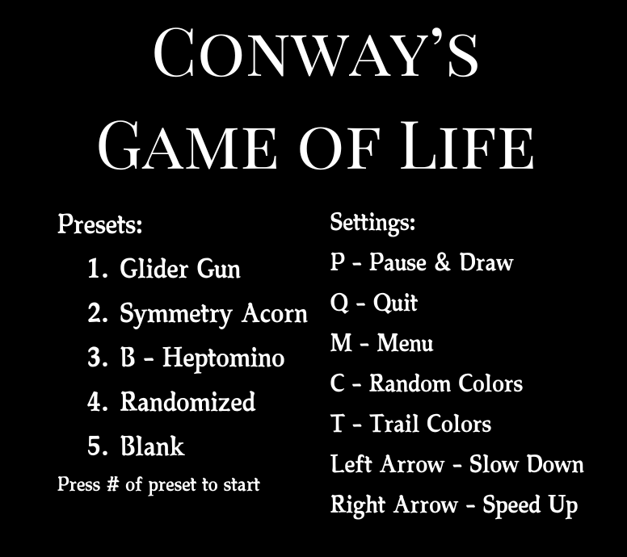
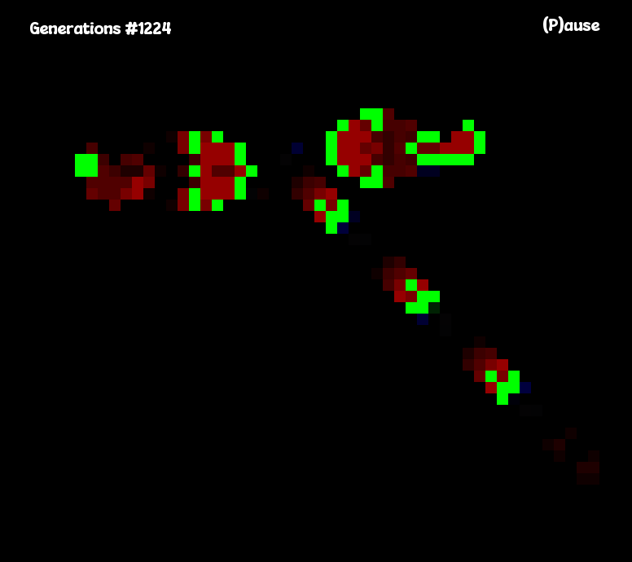

# Conway's 'Game of Life'

## Introduction
Conway's 'Game of Life' is a Turing complete cellular automaton simulation developed by the British mathematician John Horton 
Conway in 1970. This is a zero player game that simulates the life cycle of cells based on a set of 
pre-defined rules. One interacts with the Game of Life by modifying an initial configuration and observing how it evolves. 
This C++ implementation uses the **Simple and Fast Multimedia Library** (SFML) for rendering the game. 📉👾📈

The universe of the Game of Life is an infinite, two-dimensional orthogonal grid of square cells, each of which is in one of 
two possible states, live or dead (or populated and unpopulated, respectively). Every cell interacts with its eight neighbors, 
which are the cells that are horizontally, vertically, or diagonally adjacent. At each step in time, the following transitions occur:

1. Any live cell with fewer than two live neighbours dies, as if by underpopulation.
2. Any live cell with two or three live neighbours lives on to the next generation.
3. Any live cell with more than three live neighbours dies, as if by overpopulation.
4. Any dead cell with exactly three live neighbours becomes a live cell, as if by reproduction.

The initial pattern constitutes the seed of the system. The first generation is created by applying the above rules simultaneously to every cell in the seed, live or dead; births and deaths occur simultaneously, and the discrete moment at which this happens is sometimes called a tick.[nb 1] Each generation is a pure function of the preceding one. The rules continue to be applied repeatedly to create further generations.

## Features
- **Interactive Grid**: Allows users to toggle cells in a Paused state.
- **Dynamic Simulation**: Watch cells evolve over time based on the Game of Life rules.
- **Preset Loading**: Loads interesting simulations.
- **Configurable**: Ability to randomize cell colors, view cell tracing, change simulation speed.
- **Pause/Resume Functionality**

## Dependencies
- C++17 (or higher)
- SFML 2.5
- CMake (to build)

## Installation
1. ### SFML
  **Linux (Debian)**: ```sudo apt-get install libsfml-dev```

  **MacOS**: ```brew install sfml``` (Install Homebrew if 'brew' not recognized')
  Also disregard the shared_ptr issues with clangd. These have no effect on how the application runs.

  **Windows**: App not tested on Windows. Install SMFML to your own IDE.

2. ### Compile & Run
  Provide executing options to the compile.sh script with ```chmod +x compile.sh``` and run with ```./compile.sh```.

  Alternatively, you could run the following commands within the project directory:
  ```bash
  mkdir build/
  cd build/
  cmake ..
  make
  ./GameOfLife
  ```

## How To Play
1. Run the application, select from the menu which preset you'd like to start off with using your number keys.
2. When the "Pause" text is red, the game is paused and you can click on the board to toggle cells.
3. Press "P" to toggle pause.
4. Press "M" to go back to the menu.
5. Press "T" to toggle cell trails.
6. Press "C" to toggle random cell colors.
7. Press "Q" to quit the application.

## Snapshots




## License
Standard MIT license. Feel free to modify as you please.

## Author
Created by [@sudfish](https://github.com/sudfish)
